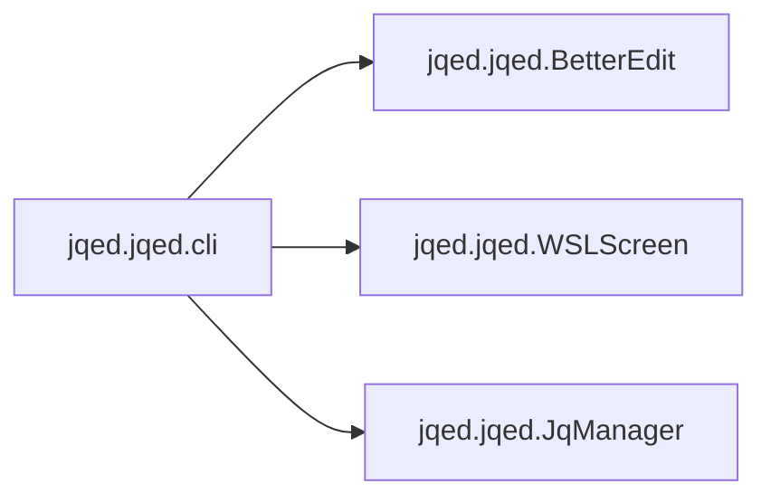

# Jqed Jqed

[_Documentation generated by Documatic_](https://www.documatic.com)

<!---Documatic-section-Codebase Structure-start--->
## Codebase Structure

<!---Documatic-block-system_architecture-start--->
```mermaid
None
```
<!---Documatic-block-system_architecture-end--->

# #
<!---Documatic-section-Codebase Structure-end--->

<!---Documatic-section-jqed.jqed.cli-start--->
## [jqed.jqed.cli](3-jqed_jqed.md#jqed.jqed.cli)

<!---Documatic-section-cli-start--->


### Object Calls

* jqed.jqed.BetterEdit
* jqed.jqed.WSLScreen
* jqed.jqed.JqManager

<!---Documatic-block-jqed.jqed.cli-start--->
<details>
	<summary><code>jqed.jqed.cli</code> code snippet</summary>

```python
def cli():
    global inp, err_bar, orig_stdin, orig_stdout, body, loop, jq_man
    if sys.stdin.isatty():
        sys.stderr.write('error: jqed requires some data piped on standard input, for example try: `ip --json link | jqed`\n')
        exit(1)
    if len(sys.argv) > 2:
        sys.stderr.write('usage: jqed [initial expression]\n')
        exit(1)
    orig_stdin = os.fdopen(os.dup(sys.stdin.fileno()))
    orig_stdout = os.fdopen(os.dup(sys.stdout.fileno()), mode='wb', buffering=0)
    os.close(0)
    os.close(1)
    sys.stdin = open('/dev/tty', 'rb')
    sys.stdout = open('/dev/tty', 'wb')
    if IS_WSL:
        urwid_screen = WSLScreen()
    else:
        urwid_screen = urwid.raw_display.Screen()
    inp = BetterEdit(('prompt_ok', PROMPT))
    if len(sys.argv) == 2:
        inp.set_edit_text(sys.argv[1])
        inp.set_edit_pos(len(sys.argv[1]))
    body = urwid.Text('')
    body_filler = urwid.AttrMap(urwid.Filler(body, 'top'), 'body_plain')
    err_bar = urwid.Text(('inp_plain', 'HELP: ^C: Exit, ^P: Pause, jq manual: https://stedolan.github.io/jq/manual'))
    frame = urwid.Frame(body_filler, header=urwid.AttrMap(inp, 'inp_plain'), footer=urwid.AttrMap(err_bar, 'err_bar'), focus_part='header')
    loop = urwid.MainLoop(frame, palette, handle_mouse=False, screen=urwid_screen)
    try:
        jq_man = JqManager(orig_stdin, loop)
        loop.run()
    except KeyboardInterrupt:
        line = shlex.quote(inp.edit_text.strip())
        if line.startswith("''"):
            line = line[2:]
        if line.endswith("''"):
            line = line[:-2]
        try:
            orig_stdout.write(('{}\njqed: jq editor ' + VERSION + ' https://github.com/wazzaps/jqed\n' + 'jqed: | jq {}\n').format(jq_man.out_data, line).encode())
        except BrokenPipeError:
            sys.stderr.write('jq {}\n'.format(line))
        exit(0)
```
</details>
<!---Documatic-block-jqed.jqed.cli-end--->
<!---Documatic-section-cli-end--->

# #
<!---Documatic-section-jqed.jqed.cli-end--->

[_Documentation generated by Documatic_](https://www.documatic.com)